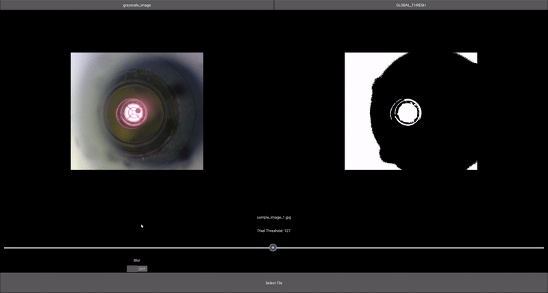
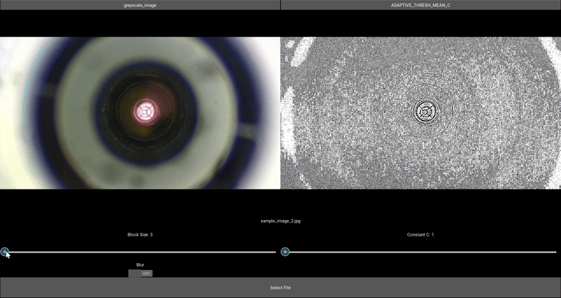

# Light analyzer

Uses functions from the OpenCV library to detect anomalies in light sources.

The below GIF highlights a simple example:



The below GIF illustrates a more difficult example, making use of a different threshold algorithm and swapping between image channels.



## Installation steps:

1. Check that you have the correct python version installed, which can be found inside `.python-version`.
    - if you're unsure how to manage multiple python installations, [pyenv](https://github.com/pyenv/pyenv) is a good solution.
    - If you're running this on a PC, it's good practice to create a [virtualenv](https://virtualenv.pypa.io/en/latest/user_guide.html).
2. Run the following command inside a terminal:
```bash
pip install -r requirements.txt
```

# Running the Application
Via the command line:
```bash
python -m light_detection
```

# Tests
This project uses `pytest` for testing. in order to execute the tests, simply run `pytest` in the root directory of the project.

## TODO:
 - [X] Rewrite to use `.kv` files where applicable :)
 - [ ] Allow a Video option instead of just static images
 - [ ] (Possibly) Use Poetry or PDM for managing the project
 - [ ] Add CI flow
